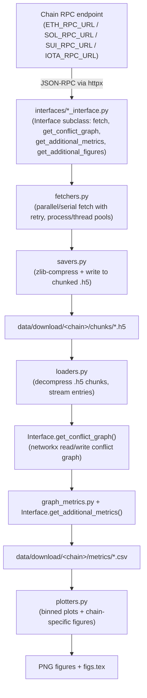

# Chain Grapher

Chain Grapher fetches historical block/checkpoint data from Ethereum, Solana, Sui, and IOTA (Rebased) RPC nodes, builds per-block **transaction conflict graphs** (nodes = transactions, edges = read/write-set conflicts between them), computes graph-theoretic and chain-specific metrics over those graphs, and plots the results. It is a research pipeline for studying parallelism/contention in blockchain transaction execution, built for offline batch analysis rather than as a live service.

## Publications

### Ethereum
- **Title:** Ethereum Conflicts Graphed
- **Authors:** Dvir David Biton, Roy Friedman, Yaron Hay
- **Venue / Year:** 2025 IEEE International Conference on Blockchain and Cryptocurrency (ICBC), pp. 1–9
- **Relevant code:** [src/interfaces/eth_call_interface.py](src/interfaces/eth_call_interface.py), [src/interfaces/eth_prestate_interface.py](src/interfaces/eth_prestate_interface.py)

### Solana
- **Title:** Analyzing Solana's Blocks and Transactions
- **Authors:** Yaron Hay, Dvir David Biton, Roy Friedman
- **Venue / Year:** The 28th International Symposium on Stabilization, Safety, and Security of Distributed Systems (SSS 2026) (accepted, not yet published)
- **Relevant code:** [src/interfaces/solana_interface.py](src/interfaces/solana_interface.py) — also the only chain currently wired into the [src/main.py](src/main.py) entrypoints (`do_download`, `do_metrics`, `do_more_metrics`, `do_plots`, `graph` all hardcode the Solana data directory and `crypto_interface = solana_interface`)

### Sui
- **Title:** An Analysis of Sui's Transactions and Conflicts
- **Authors:** Dvir David Biton, Roy Friedman
- **Venue / Year:** 2025 IEEE 30th Pacific Rim International Symposium on Dependable Computing (PRDC)
- **Relevant code:** [src/interfaces/sui_interface.py](src/interfaces/sui_interface.py)

## Key features

- Pulls raw block/checkpoint traces over JSON-RPC from a configurable node per chain (Ethereum `debug_traceBlockByNumber`, Solana `getBlock`, Sui/IOTA `sui_getCheckpoint`/`iota_getCheckpoint` + `*_multiGetTransactionBlocks`).
- Builds a read-set/write-set conflict graph per block using chain-specific parsing logic (per-chain `Interface` subclass in [src/interfaces/](src/interfaces/)).
- Computes ~15 graph metrics per block (clique number, diameter, modularity, degeneracy, vertex cover approximations, assortativity, etc.) in [src/graph_metrics.py](src/graph_metrics.py), plus chain-specific metrics (fees, compute units, tx-kind breakdowns, transferred value, ...).
- Stores raw traces as zlib-compressed, chunked HDF5 files and metrics as CSV, so multi-million-block runs don't require a database.
- Parallel fetch/compute via `ProcessPoolExecutor`/`ThreadPoolExecutor`, with resumable downloads (skips already-fetched chunks) and retry/backoff on RPC calls.
- Generates per-metric plots (binned by tx count vs. graph density) plus chain-specific figures (e.g. Sui tx-kind and object-write pie charts) as PNGs and a LaTeX `\includegraphics` snippet.

## Architecture



[src/main.py](src/main.py) is the CLI entrypoint that drives this pipeline. It registers a small set of named "entrypoints" (`do_download`, `metrics`/`do_more_metrics`, `do_plots`, `graph`) selected via `sys.argv[1]`. As written, all of these entrypoints operate on `crypto_interface = solana_interface` and the `./data/download/solana/` directory — see [Usage](#usage) for how to point the pipeline at a different chain.

## Requirements

- Python 3.10+ (pinned in [.python-version](.python-version))
- Packages in [requirements.txt](requirements.txt): `networkx`, `pandas`, `python-dotenv`, `httpx`, `h5py`, `h5pickle`, `matplotlib==3.9.0`, `infixpy`, `scipy`
- Network access to an RPC endpoint per chain you want to fetch from (a full/archive node or a third-party RPC provider — block traces for Ethereum require `debug_traceBlockByNumber`, which most public RPC endpoints do not expose)
- Local disk for raw traces and metrics: HDF5 chunk files hold `filesize` (e.g. 1,000) blocks each, compressed with zlib; size scales with chain activity and chunk size, budget accordingly for multi-thousand-block downloads
- No GPU or special hardware required; CPU/core count controls fetch and metric-computation parallelism (see [Configuration](#configuration))

## Installation

```bash
git clone git@github.com:dbiton/chaingrapher.git
cd chaingrapher
pip install -r requirements.txt
```

Create a `.env` file at the repo root with your RPC URLs and block range (see [Configuration](#configuration); `.env` is git-ignored).

## Configuration

Configuration is via environment variables, loaded from a `.env` file at the repo root by `python-dotenv` (`load_dotenv(override=False)` in [src/main.py](src/main.py) — real environment variables take precedence over `.env`).

| Variable | Meaning | Default |
|---|---|---|
| `SOL_RPC_URL` | Solana JSON-RPC endpoint used by `SolanaInterface` | none — required for Solana runs |
| `ETH_RPC_URL` | Ethereum JSON-RPC endpoint (must support `debug_traceBlockByNumber`) used by `EthCallInterface`/`EthPerstateInterface` | none — required for Ethereum runs |
| `SUI_RPC_URL` | Sui JSON-RPC endpoint used by `SuiInterface` | none — required for Sui runs |
| `IOTA_RPC_URL` | IOTA (Rebased) JSON-RPC endpoint used by `IotaInterface` | none — required for IOTA runs |
| `START_BLOCK` | First block/slot/checkpoint to download in `do_download`; also used by `loaders.get_single_block` | none — required |
| `BLOCK_COUNT` | Number of blocks to download starting at `START_BLOCK` in `do_download` | none — required |
| `MAX_BLOCK_EXCLUDE` | Upper bound (exclusive) on block numbers processed by `do_download`/`do_metrics`/`do_more_metrics`/`do_plots` | unset (no upper bound) |
| `MIN_BLOCK_EXCLUDE` | Lower bound on block numbers processed by the same commands | unset (no lower bound) |
| `IGNORE` | Comma-separated block numbers whose chunk files are skipped | unset (empty) |
| `EXACT_LIST` | Comma-separated block numbers to restrict processing to, in `do_more_metrics` | unset (empty) |
| `MAX_FETCH_WORKERS` | Worker pool size for RPC fetches ([src/fetchers.py](src/fetchers.py)) | `25` |
| `MAX_PENDING` | Max in-flight block fetch/metric jobs at once | `6` |
| `MAX_METRIC_WORKERS` | Process pool size for metric computation (`-1` = `os.cpu_count()`) | `-1` |
| `LOAD_MAXPENDING` | Max in-flight `.h5` chunk decompression jobs in [src/loaders.py](src/loaders.py) | `2` |

## Usage

All commands are run from `src/` (imports and data paths in `main.py` are relative to that directory):

```bash
cd src
```

Before downloading, create the directory tree the Solana pipeline writes to (nothing in the code creates these for you):

```bash
mkdir -p data/download/solana/chunks data/download/solana/inprog data/download/solana/figures data/download/solana/metrics/v2 data/download/solana/metrics/v3
```

### Download raw block data

Downloads `BLOCK_COUNT` Solana blocks starting at `START_BLOCK` (or resumes after the last downloaded chunk if one exists), in chunks of 1,000 blocks per `.h5` file:

```bash
python main.py do_download
```

### Compute graph + chain metrics

Processes every chunk under `data/download/solana/chunks/` that doesn't already have a metrics CSV, writing one CSV per chunk to `data/download/solana/metrics/`:

```bash
python main.py metrics
```

`do_more_metrics` recomputes/adds specific extra columns (named as CLI args) onto an existing metrics CSV, reading from `metrics/v2` and writing to `metrics/v3`:

```bash
python main.py do_more_metrics isolates edge-count instructions
```

### Plot results

Reads every CSV under `data/download/solana/metrics/v2/` and writes per-metric plots plus chain-specific figures to `data/download/solana/figures/`:

```bash
python main.py do_plots
```

### Inspect a single conflict graph

Loads one hardcoded block (`block_number = 390000000` in [src/main.py](src/main.py)) and renders its conflict graph with `matplotlib`:

```bash
python main.py graph
```

### Running against Ethereum, Sui, or IOTA

`EthCallInterface`, `EthPerstateInterface`, `SuiInterface`, and `IotaInterface` all implement the same `Interface` contract as `SolanaInterface`, but none of the `main.py` entrypoints currently target them — `crypto_interface` is hardcoded to `solana_interface` and `dirpath` is hardcoded to `"./data/download/solana/"` throughout [src/main.py](src/main.py). To run the pipeline against another chain, point `crypto_interface` at the desired interface instance and change the `"solana"` path segments accordingly.

## Data model / output format

- **Raw traces** (`data/download/<chain>/chunks/<start>_<end>.h5`): an HDF5 file with a single `dataset` of variable-length `uint8` arrays. Each array is a zlib-compressed, ASCII-encoded JSON list of `[block_number, result]` (or `[block_number, result, extra]` for Ethereum prestate) entries, `CHUNK_SIZE = 100` entries per array ([src/savers.py](src/savers.py), [src/loaders.py](src/loaders.py)).
- **Metrics CSV** (`data/download/<chain>/metrics/*.csv`): one row per block/checkpoint, columns sorted alphabetically. Always includes `block_number`; per-chain columns vary (e.g. Solana adds `txs`, per-standard-program instruction counts; Sui adds `digest`, `epoch`, `timestampMs`, `user_tx_count`, `kind_*_count`, `inputs_*`, `writes_*`, `failed_*`). Graph metrics from [src/graph_metrics.py](src/graph_metrics.py) are merged in: `clique_number`, `diameter`, `cluster_coe`, `transitivity`, `modularity`, `degeneracy`, `greedy_color`, `longest_path_length_monte_carlo`, `assortativity`, `largest_conn_comp`, `vertex_cover_nx_approx`, `max_degree`, `degree`, `density`.
- **Figures** (`data/download/<chain>/figures/*.png`, `figs.tex`): one PNG per numeric metric (density-binned, split by tx-count quartile) plus chain-specific figures returned by `Interface.get_additional_figures`. `figs.tex` accumulates a LaTeX `\begin{figure}...\end{figure}` snippet per plot for direct inclusion in a paper.

## Repository layout

```
.
├── .python-version              # pinned Python version
├── requirements.txt            # pip dependencies
├── figures/                   # currently unused by code (see note above)
└── src/
    ├── main.py                 # CLI entrypoints: do_download, metrics, do_more_metrics, do_plots, graph
    ├── fetchers.py              # parallel/serial RPC fetch helpers with retry
    ├── loaders.py               # streaming decompression of .h5 trace chunks
    ├── savers.py                # zlib-compress + append traces to .h5 chunks
    ├── graph_metrics.py         # networkx-based graph metric functions
    ├── plotters.py               # matplotlib plotting of metrics CSVs
    └── interfaces/
        ├── interface.py          # base Interface class (RPC POST w/ retry+cache, generic conflict-graph builder)
        ├── solana_interface.py   # Solana getBlock parsing, read/write-set + program extraction
        ├── eth_call_interface.py     # Ethereum debug_traceBlockByNumber (callTracer) conflict graph
        ├── eth_prestate_interface.py # Ethereum debug_traceBlockByNumber (prestateTracer) conflict graph
        ├── sui_interface.py       # Sui checkpoint/tx fetching, conflict graph, tx-kind/object-write metrics + figures
        └── iota_interface.py      # IOTA Rebased (MoveVM) checkpoint/tx fetching, conflict graph
```

## Citation

```bibtex
@inproceedings{biton2025ethereumconflicts,
  title     = {Ethereum Conflicts Graphed},
  author    = {Biton, Dvir David and Friedman, Roy and Hay, Yaron},
  booktitle = {2025 IEEE International Conference on Blockchain and Cryptocurrency (ICBC)},
  pages     = {1--9},
  year      = {2025},
  url       = {TBD},
}
```

```bibtex
@inproceedings{hay2026solanablocks,
  title     = {Analyzing Solana's Blocks and Transactions},
  author    = {Hay, Yaron and Biton, Dvir David and Friedman, Roy},
  booktitle = {The 28th International Symposium on Stabilization, Safety, and Security of Distributed Systems (SSS 2026)},
  note      = {accepted, not yet published},
  year      = {2026},
  url       = {TBD},
}
```

```bibtex
@inproceedings{biton2025suiconflicts,
  title     = {An Analysis of Sui's Transactions and Conflicts},
  author    = {Biton, Dvir David and Friedman, Roy},
  booktitle = {2025 IEEE 30th Pacific Rim International Symposium on Dependable Computing (PRDC)},
  year      = {2025},
  url       = {TBD},
}
```
